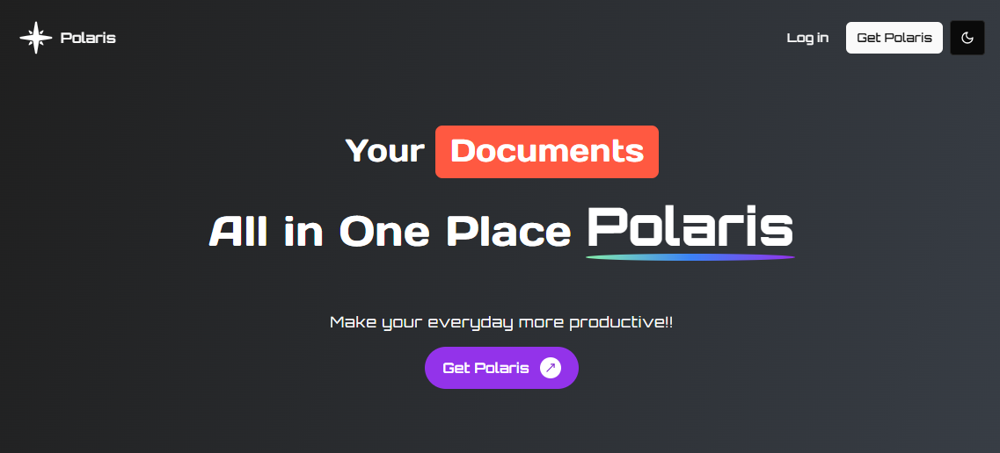

# ✨ Polaris - Make your everyday more productive!!

A  productivity app for managing and craeting Dynamic douments , shareing them ,  daily task management, Classes tracking, Assignemnts, Exams tracking, Habit tracking , Get daily motivational Quotes , weather AQI updates.

## Technologies 
         

### 📝 Enhanced Block Note Documents
A distraction-free, block-based rich text editor designed for efficient content creation.

- Versatile formatting options  
- Lightweight and fast  
- Built on **Blocknote**  
- Instantly shareable with anyone  

### 📊 Dynamic Dashboard
All-in-one dashboard to organize tasks, academics, and habits.

- Task & deadline tracker  
- Exam and study planner  
- Study time and productivity monitor  
- Habit tracking with progress analytics  

### 🤖 AI Chatbot Assistant
A smart AI assistant powered by **Gemini (Google's Generative AI)** to help with learning, writing, and research.

- Answer complex questions  
- Analyze images and content  
- Generate notes & creative text  
- Discover curated educational resources  

### 🎨 Interactive Drawing Canvas
Collaborative and intuitive canvas for visual thinkers.

- Freehand sketching & mind mapping  
- Real-time collaboration  
- Export in multiple formats  

## 🛠️ Built With

- **Next.js 15** – App router & latest React features 
- **React 19** - comes with nextjs 15
- **Convex** - for Database 
- **Clerk** - for authentication
- **Blocknote** – Rich text editor  
- **Gemini AIP** – Google generative AI integration  
- **Tailwind CSS** - Modern styling

<!-- NEXT_PUBLIC_CLERK_PUBLISHABLE_KEY=""
CLERK_SECRET_KEY=""

EDGE_STORE_ACCESS_KEY=""
EDGE_STORE_SECRET_KEY=""
NEXT_PUBLIC_ADMIN_PASSWORD=""
NEXT_PUBLIC_WEATHER_API_KEY=""
NEXT_PUBLIC_APIKEY=""
CONVEX_DEPLOYMENT=""
NEXT_PUBLIC_CONVEX_URL="" -->
